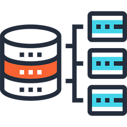

    

<!-- 

    
    
    
    

 -->

   <h1 align="center">Backend-diff</h1>

    
 

## Backend-diff JS and TS
  
  Backend-diff uses a stack full `JS/TS` on the backend, I'm making this project to improve
  my skills in the backend.
  
## Initing in the your PC

- For clone the project `git clone https://github.com/Wellers0n/Backend-diff.git`
- Enter in the folder `cd Backend-diff/`
- To install project dependency: `yarn install`
- After the installation of the dependencies `yarn start` in the default directory

## Stack used

[NodeJS](https://nodejs.org/en/) 
[KoaJS](https://koajs.com/) 
[MongoDB](https://www.mongodb.com/) 
[GraphQL](https://graphql.org/) 
[Yarn](https://yarnpkg.com/en/) 
[WorkSpaces](https://yarnpkg.com/lang/en/docs/workspaces/) 